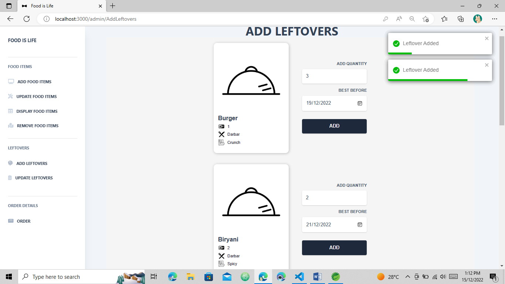

# `Food is Life Web Application`

## INTRODUCTION: 

The world is facing devastating climate changes in the past years which results in the starvation of multitudes of species and, due to scarcity of food supply, poverty has drastically increased in the state of Pakistan. NGOs are working to help families at their best in terms of supplying food items and shelter. Around 90% of restaurants have an extremely high percentage of leftovers. And, there is a dire need for food supplies in the affected areas. So, these leftovers could be one of the ways to help the victims. NGOs will take leftovers from the chosen restaurants and supply them to the needy people, catering to all the needy people in the specific areas where NGOs and restaurants can deal with each other feasibly.

## SCHEMA:

</img>

</img>

## Website Snapshots:

</img>
</img>
</img>